## Hi there 👋 I'm Marwen

> ⚠️ First of all, I want to say that this is my newly created GitHub because sadly my old one was hacked 😢💔
>
> 🔐 Guys, please enable 2FA yourselves before any hacker does it for you, and always, ALWAYS keep local backups for your repositories. 💾

### I'm Marwen, a robotics, computer vision and industrial automation engineer from Tunisia 🇹🇳, obsessed with computer vision and IoT systems.

### 🛠️ What I build

- 🤖 Autonomous mobile robots and everything that comes with them: path planning, motion control, localization, obstacle avoidance
- 🦾 Camera-guided industrial robot arms
- 👁️ Vision pipelines (object detection, segmentation, OCR, VLMs ...etc) automating repetitive inspection tasks
- 🏭 Simulation of whole industrial workflows and the PLC control logic running them
- 🖥️ SCADA systems for real-time control and supervision
- 📡 IoT data pipelines, dashboards, and agentic AI to manipulate and extract maximum value from this data

### 🌱 Right now

- 🧠 Catching up with the current AI stack: vision transformers and multimodal architectures, parameter-efficient fine-tuning (LoRA, QLoRA), quantized inference on edge hardware, and tool-calling agents
- 🏭 Deepening my understanding of process plants: MTP-based modular automation, ISA-88 batch control and the VDI/VDE/NAMUR 2658 service model
- 👁️ Learning VLMs in depth: vision encoders, projection layers, visual grounding, and fine-tuning for industrial inspection
- 🇩🇪 Learning German

### 🧰 Tools

**💻 Languages**

  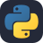   

**👁️ Computer Vision & AI**

  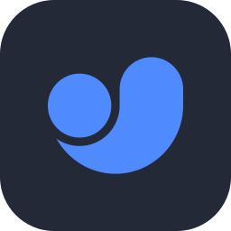  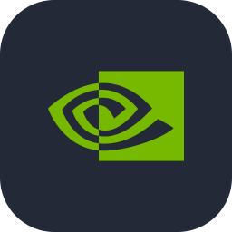 

**🤖 Robotics & Embedded**

 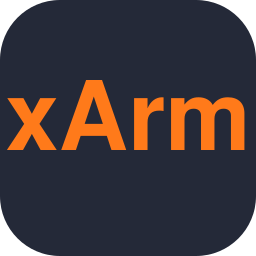 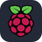 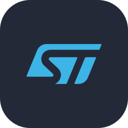 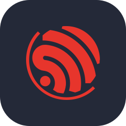  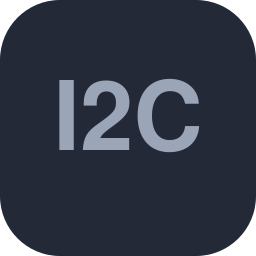 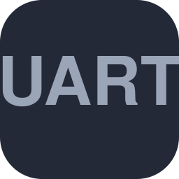  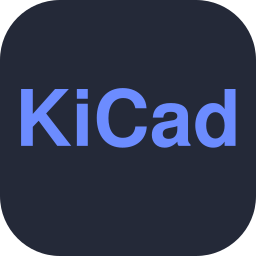 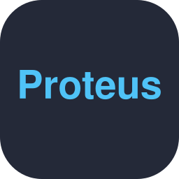 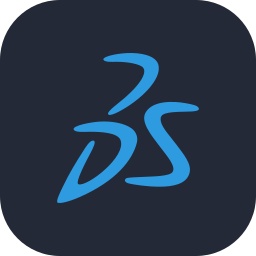

**🏭 Industrial Automation**

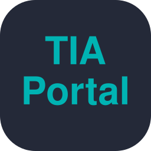 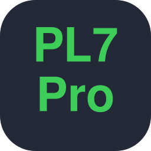 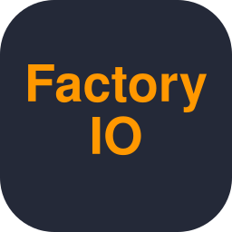 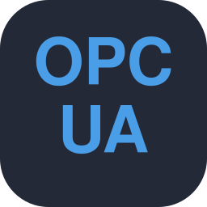 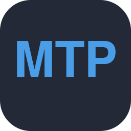 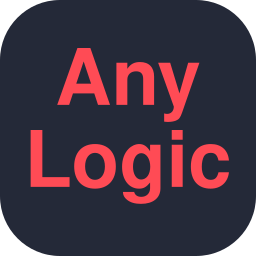  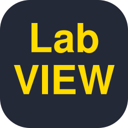 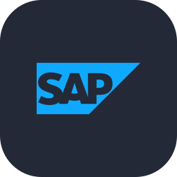

**📡 IoT & Web**

 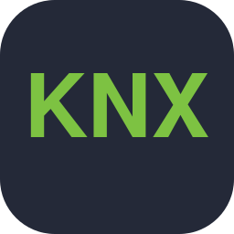 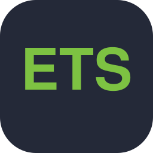 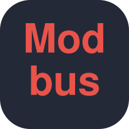 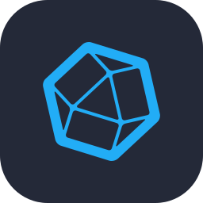         
